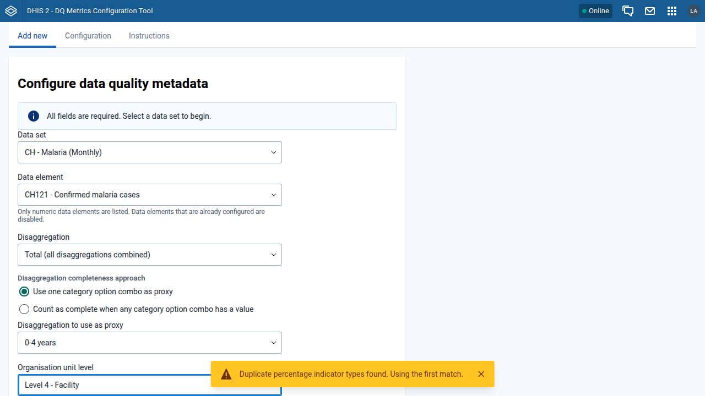
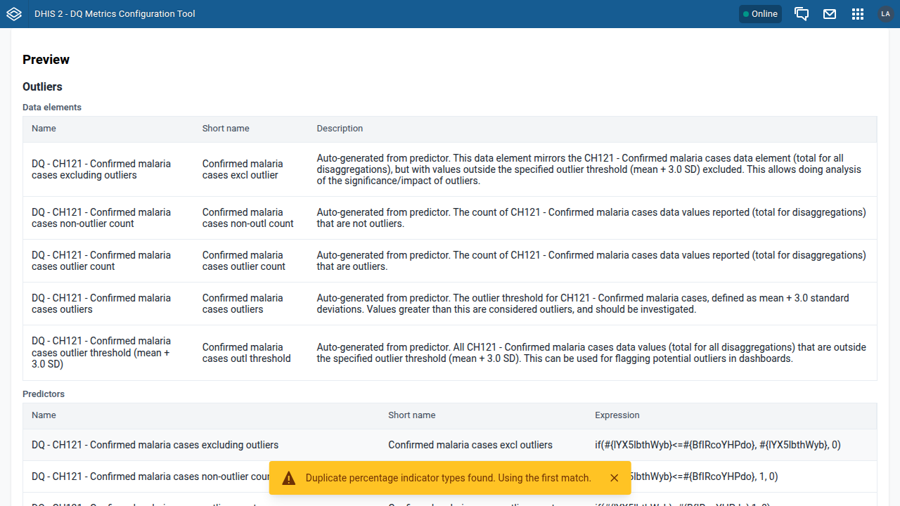
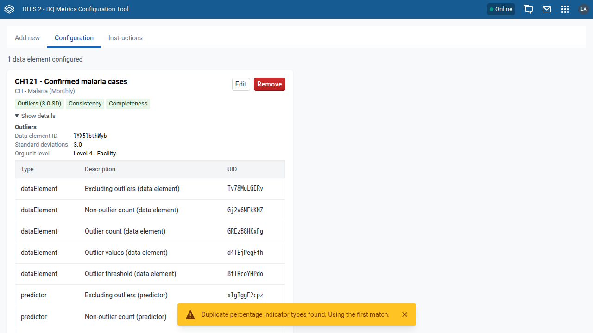

# UI test results: DQ Metrics Configuration Tool v1.0.0

Tested: 2026-07-15 · App served as installed zip (`POST /api/apps`), driven with playwright-cli · Reusable suite: `tests/e2e/lifecycle.sh`

## Instances

| Label   | URL                               | DHIS2 version | Source                                                                                              |
| ------- | --------------------------------- | ------------- | --------------------------------------------------------------------------------------------------- |
| SL 41   | http://dhis2-agent-dq-sl41:8080   | 2.41.9        | broker, seed `dhis2-db-sierra-leone_v41`                                                            |
| SL 43   | http://dhis2-agent-dq-sl43:8080   | 2.43.0.1      | broker, seed `dhis2-db-sierra-leone_v43`                                                            |
| Laos 41 | http://dhis2-agent-dq-laos41:8080 | 2.41.9        | broker, seed `lao_hmis_demo_v41`                                                                    |
| Laos 43 | http://dhis2-agent-dq-laos43:8080 | 2.43.0.1      | broker, seed `lao_hmis_demo_v41` migrated by Flyway on boot (also validates the 41→43 upgrade path) |

Test metadata: Sierra Leone — data set _Morbidity_, DE _Measles new_ (age-disaggregated), proxy CoC _12-59m_, level 4 (Facility). Laos — data set _CH - Malaria (Monthly)_, DE _CH121 - Confirmed malaria cases_ (age-disaggregated), proxy CoC _0-4 years_, level 4 (Facility).

## Results

Final build unless noted. SL 41 additionally ran the exhaustive scenarios (conflict path, gate-failure paths) during iterative fixing.

| Step                                                                                             | SL 41                                    | SL 43                                      | Laos 41                     | Laos 43                    |
| ------------------------------------------------------------------------------------------------ | ---------------------------------------- | ------------------------------------------ | --------------------------- | -------------------------- |
| App installs (`POST /api/apps`)                                                                  | PASS (204)                               | PASS (201)                                 | PASS (204)                  | PASS (201)                 |
| App loads with header bar / global shell                                                         | PASS (top-level)                         | PASS (global-shell iframe)                 | PASS (top-level)            | PASS (global-shell iframe) |
| Initialise modal on fresh instance → groups + dataStore created                                  | PASS (7 groups + 4 keys verified)        | PASS                                       | PASS                        | PASS                       |
| Form: data set → DE (numeric only) → disaggregation → completeness approach → OU level           | PASS                                     | PASS                                       | PASS                        | PASS                       |
| OU levels not assigned to data set disabled with suffix                                          | PASS                                     | PASS                                       | PASS (only level 4 enabled) | PASS                       |
| Preview: 3 check sections, correct substituted names/expressions                                 | PASS                                     | PASS                                       | PASS (27 col headers)       | PASS                       |
| Proxy completeness uses operand `deId.cocId` in numerator                                        | PASS                                     | PASS                                       | PASS                        | PASS                       |
| "Any value" completeness generates DE + predictor + indicator                                    | PASS                                     | not run                                    | not run                     | not run                    |
| Import: 16/16 steps OK; sharing `r-------` public + admin group rw                               | PASS                                     | PASS                                       | PASS                        | PASS                       |
| Configured DE disabled in select after import                                                    | PASS                                     | not re-run                                 | not re-run                  | not re-run                 |
| Overview card: chips (SD value), data set, details tables                                        | PASS                                     | PASS                                       | PASS                        | PASS                       |
| Edit outlier threshold 3.0→2.5 (names, expression, dataStore)                                    | PASS (verified via API)                  | PASS                                       | PASS                        | PASS                       |
| Remove config only (keep metadata): store + groups cleaned, metadata retained                    | PASS                                     | not run                                    | not run                     | not run                    |
| Re-configure same DE → conflicts highlighted, Import disabled                                    | PASS (31 ⚠ cells, legend, warning alert) | not run                                    | not run                     | not run                    |
| Remove incl. metadata after app edit: everything deleted                                         | PASS                                     | PASS                                       | PASS                        | PASS                       |
| Gate: manually modified object blocks only its check ("modified after creation"), others deleted | PASS                                     | PASS (pre-fix build; observed as designed) | not run                     | not run                    |
| Empty state with "Add new" link after last removal                                               | PASS                                     | PASS                                       | PASS                        | PASS                       |

## Version-specific failures

**None on the final build.** Differences observed and handled:

- 2.42+ serves the installed app inside the global-shell iframe; all flows pass there (the e2e suite is frame-aware).
- `POST /api/apps` returns 204 on 2.41 vs 201 on 2.43 (expected drift).
- Lao demo has multiple 100-factor indicator types → the app correctly warns once per session ("Duplicate percentage indicator types found. Using the first match.").

## Bugs found by testing (all fixed and re-verified — details in REVIEW-FINDINGS.md)

1. **H1**: metadata deletion always skipped ("not owned by app") — gate ordering bug inherited from the original tool. Found on SL 41.
2. **H2**: DHIS2 ignores `dryRun=true` on DELETE imports — the "dry-run" gate really deleted predictors/indicators. Found on SL 41 via network capture; confirmed with isolated curl reproduction.
3. **H3**: app's own threshold edit tripped the "modified after creation" gate, blocking later deletion. Found on SL 43.

## Console/network hygiene

Benign, consistent across versions:

- `PWA features will not work` — the instances are plain HTTP (no secure context); not an app bug.
- `404 /api/41/staticContent/logo_banner` — instance has no custom logo; requested by the header bar, not the app.
- Two `StyleSheet: illegal rule` warnings from `@dhis2/ui`'s CSS reset (`-moz-` rules in Chromium) — cosmetic, library-level.

No failed app API requests and no app-origin console errors in any passing flow.

## Screenshots

See `screenshots/` in this folder (captured on Laos 2.43, final build).

