# DHIS2 Data Quality Configuration — User Manual

This app helps administrators set up automated data-quality metadata in DHIS2 for a chosen data element. From a single form, it generates three families of DQ metrics (outliers, consistency, and completeness) as DHIS2 data elements, predictors, and indicators — no manual metadata editing required.

The app has three tabs:

- **Add new** — configure a new data element
- **Configuration** — review, edit, or remove existing configurations
- **Instructions** — in-app quick reference

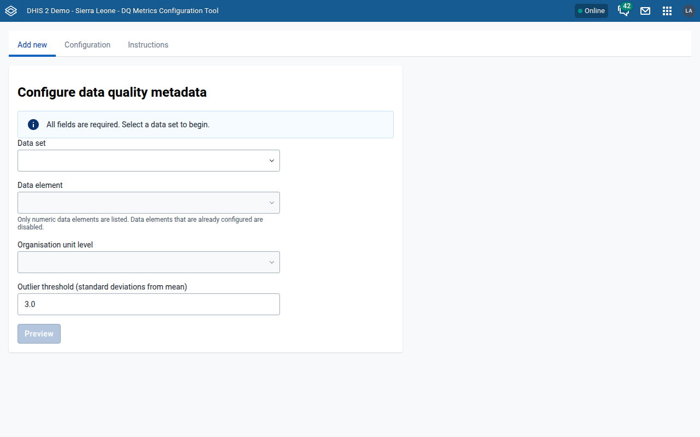

---

## The three DQ metrics

| Metric | What it measures |
|---|---|
| **Outliers** | Values more than *N* standard deviations above the mean. Generates 5 data elements, 5 predictors, and 2 indicators. |
| **Consistency** | Whether an org unit reports in all / any of the last 12 months. Generates 2 data elements, 2 predictors, and 1 indicator. |
| **Completeness** | 100 × (reports received) / (reports expected). Generates 1 indicator (or 1 DE + 1 predictor + 1 indicator for disaggregated completeness). |

The generated items are added to app-managed DHIS2 metadata groups so the app can track them for later edit/remove.

---

## Adding a new configuration

### 1. Select a data set

Click the field to open the list, type in the filter box to narrow it down, then click the data set. Data sets with the "Monthly" period type are fully supported automatically.

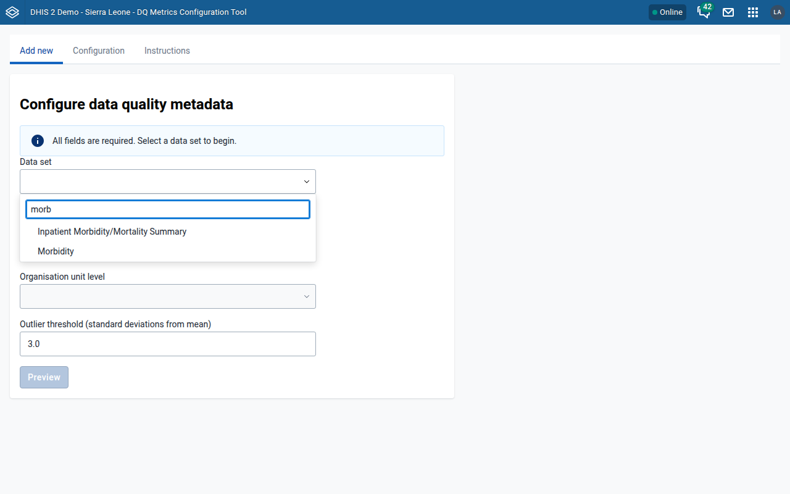

### 2. Select a data element

Once a data set is chosen, the data element list populates with that data set's members.

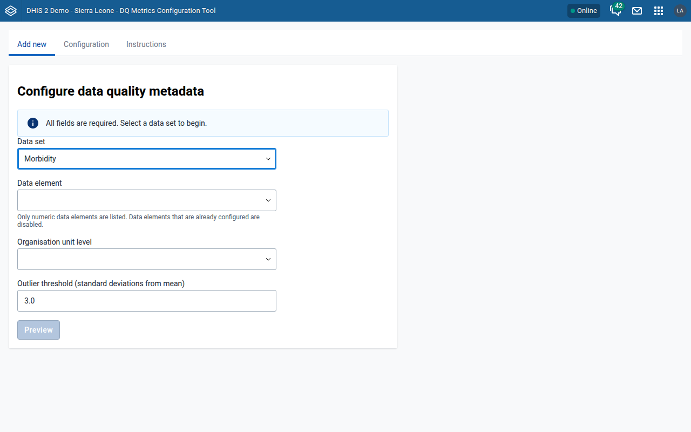

### 3. Choose a disaggregation

For data elements with a non-default category combo, a disaggregation list appears. Pick either:

- A **specific category option combo** — the DQ checks target only that combo. Completeness is computed from that combo only.
- **Total (all disaggregations combined)** — the DQ checks target the data element total. In this case you must also choose a **completeness approach** (see next step).

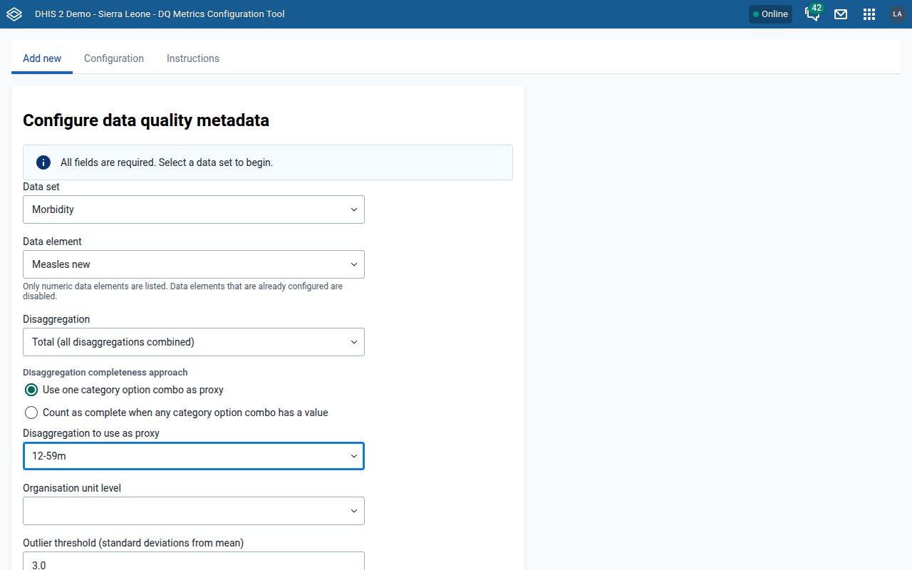

#### Completeness approach (only when "Total" is selected)

- **Use one category option combo as proxy** — treats a single combo's reporting as a proxy for overall completeness. Pick the combo from the dropdown.
- **Count as complete when any category option combo has a value** — any reported combo counts as reported.

### 4. Select an organisation unit level

Only levels that the data set is assigned to are enabled. Levels the data set is not assigned to appear greyed out with a "(not assigned to data set)" hint.

### 5. Set the outlier threshold

Defaults to 3.0 standard deviations. Permitted range is 2.0 – 4.0 in 0.1 steps.

### 6. Click Preview

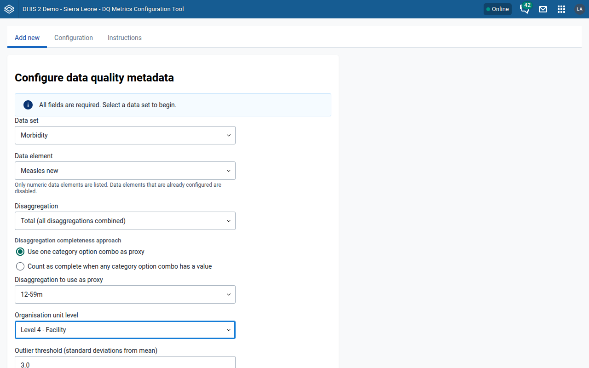

---

## Reviewing the preview

The Preview card shows every data element, predictor, and indicator the app will create, grouped by metric family. Review carefully: once imported, these objects will be created in DHIS2.

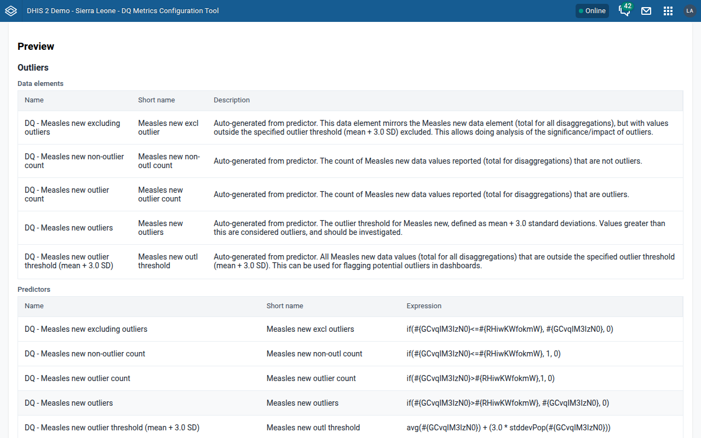

Notes:

- Completeness for a specific category option combo generates only an indicator (no DE or predictor); the table shows **N/A** for the empty rows.
- Non-monthly data sets trigger a warning — period-related expressions in the generated metadata are only correct for monthly data sets.

### Conflict detection

Before you click Import, the app checks the target DHIS2 instance for existing data elements, predictors, and indicators that already use any of the proposed `name` or `shortName` values.

If conflicts are found:

- Conflicting cells are highlighted with an orange background and a `⚠` marker.
- The **Import** button is disabled.
- A **⚠ already exists** legend appears next to the Import button explaining the marker.
- A warning notification summarises the count.

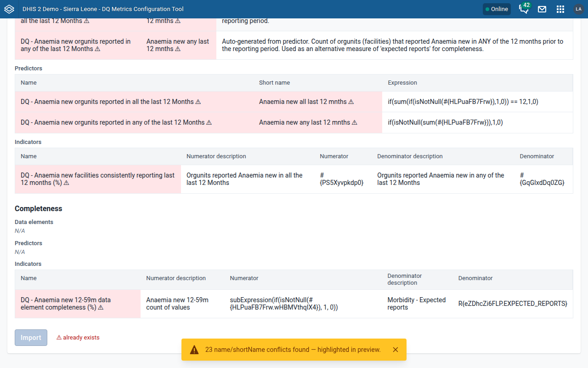

**How to resolve:** the conflicts are usually because the data element has already been configured in a previous session. Check the Configuration tab — if it's there, either keep it as-is or remove it and re-configure with different parameters.

---

## Running the import

Click **Import** to create the metadata in DHIS2. Confirm the prompt, then wait for the results card to appear. Each step of the import (per metric family: metadata POST, group memberships, and DataStore config save) is reported with an `OK` or error status.

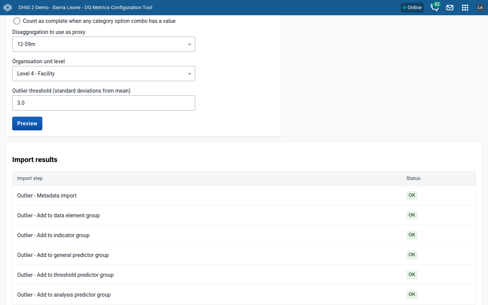

The preview is replaced by the results card once the import completes. Click **Close** to dismiss the results; the form keeps its selections (the just-configured data element is now disabled in the list), so configuring another data element only requires changing the fields that differ.

You can switch to the Configuration or Instructions tab at any point — the form and any un-imported preview are kept when you come back.

---

## Reviewing existing configurations

The **Configuration** tab lists every data element that has at least one DQ configuration stored in this app's DataStore.

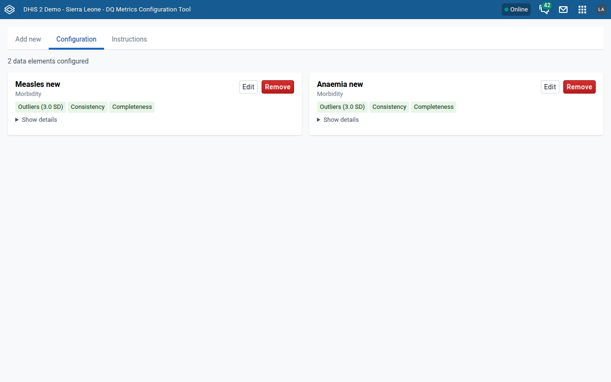

Each card shows:

- The data element name and parent data set
- Chips indicating which metrics are configured (Outliers with threshold, Consistency, Completeness)
- **Edit** and **Remove** buttons
- **Show details** to expand a per-metric breakdown of every metadata object's UID

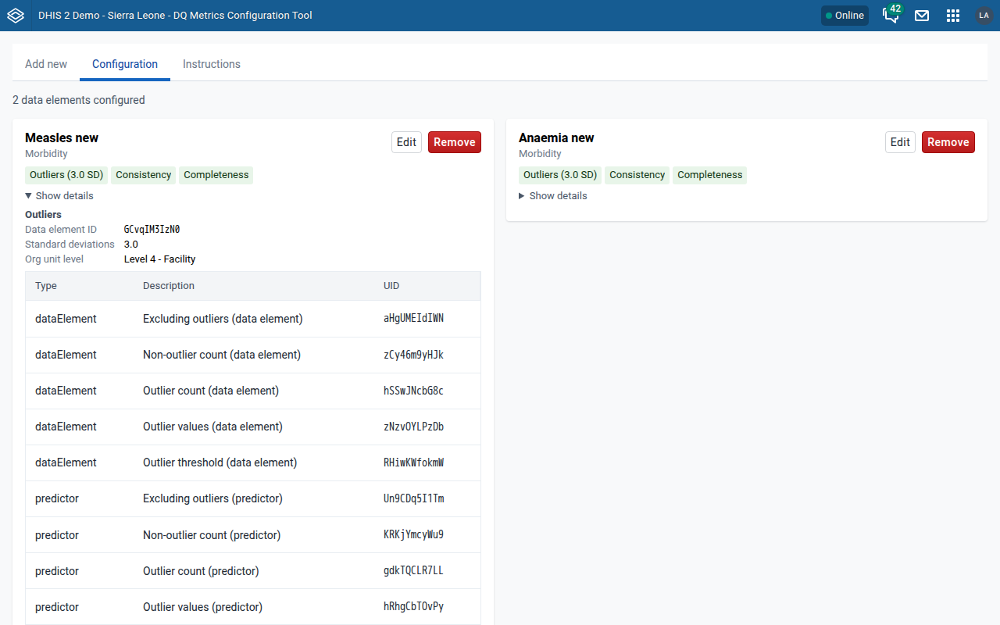

Expanding details on one card only enlarges that card — the others stay at their natural height.

### Missing-metadata warning

If any metadata object referenced by a configuration has been deleted outside this app, the card shows an orange "⚠ N missing metadata" chip. Hover for a tooltip listing which objects are missing. This usually means either a user deleted something via the Maintenance app, or a metadata export/import reshuffled UIDs.

---

## Editing a configuration

Click **Edit** on a card to change the outlier threshold. A small inline form appears under the card.

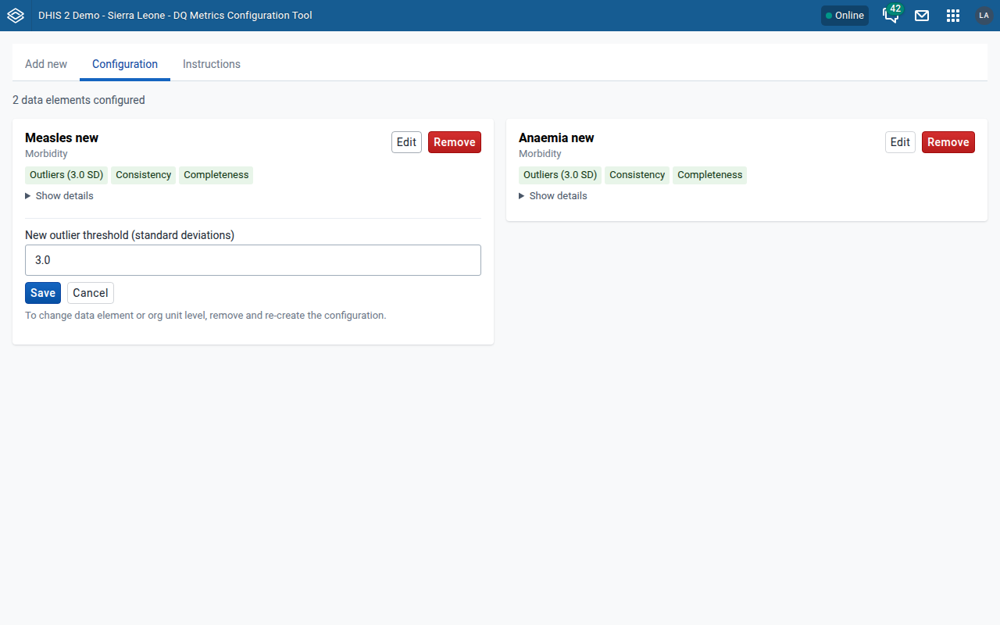

Only the outlier threshold can be edited in place. To change the data element or organisation unit level, remove the configuration and re-create it.

Saving will:

1. Update the DHIS2 descriptions of affected metadata to reflect the new threshold text
2. Update the predictor expression that calculates the threshold value
3. Save the new threshold to the DataStore entry

---

## Removing a configuration

Click **Remove** on a card. A confirmation modal appears.

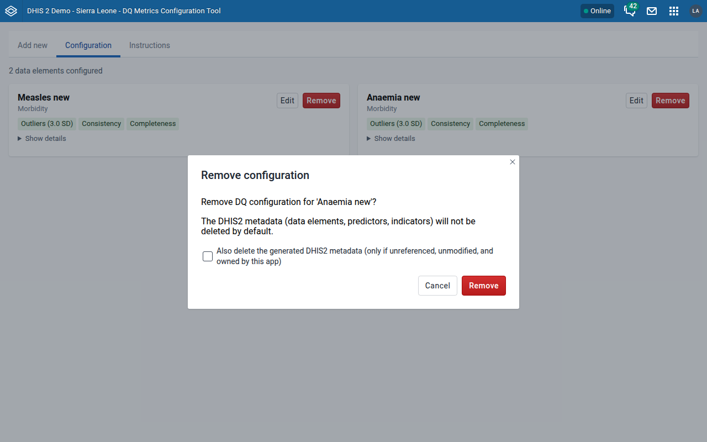

By default the app only removes its own DataStore entry — the generated DHIS2 metadata is left in place. Tick **"Also delete the generated DHIS2 metadata"** to have the app attempt to delete the data elements, predictors, and indicators as well.

### Safety checks before metadata deletion

Each of the three metrics (outliers, consistency, completeness) is treated as an atomic group. For that group's metadata to be deleted, every item in it must pass three checks:

1. **Ownership** — the item must still belong to this app's metadata groups.
2. **No edits** — the item's `lastUpdated − created` must be < 5 seconds, i.e. untouched since import. Edits made through this app (outlier-threshold changes) are recorded in the DataStore and do not count as manual edits.
3. **Template match** — the item's current `name` and `description` must still match the template's text pattern (indicating no one renamed it).

If any item in a group fails any check, the whole group is skipped and its DHIS2 metadata is left alone. The DataStore entry is still removed either way.

External references (e.g. a dashboard favorite using one of the indicators) are caught by the delete itself: each DELETE call is atomic per object type, so a blocked object makes that call fail without deleting anything else, and the failure is reported. (Earlier versions attempted a dry-run DELETE as a fourth check, but DHIS2 ignores `dryRun=true` for DELETE imports and deletes the objects for real, so the dry-run was removed.)

### Ordered deletion

When deleting metadata the app issues three separate DELETE calls per metric, in this order:

1. Indicators (nothing within the metric references them)
2. Predictors (same)
3. Data elements (safe to delete now that referencing indicators and predictors are gone)

This avoids DHIS2 refusing a single-payload delete because a data element is still referenced by the indicators/predictors being deleted alongside it.

### Result notification

After the modal closes you'll see a single notification:

- All checks succeeded: `Config removed. Outliers metadata: deleted. Consistency metadata: deleted. Completeness metadata: deleted.` (notification style: success)
- One or more skipped: lists the reason per metric (e.g. `Consistency metadata: skipped (Reported all 12 months (predictor) 'xyz' description no longer matches template)`). Notification style: warning.
- One or more failed to delete despite passing safety checks: reports the type that failed (`Outliers metadata: delete failed (indicators: ...)`). This usually means the item has an external reference that only became visible at real delete time (e.g. a dashboard favorite).

Open the browser console (`perCheckResults`) for the full per-candidate detail after a deletion.

---

## Instructions tab

A short in-app reference covering the same material in brief.

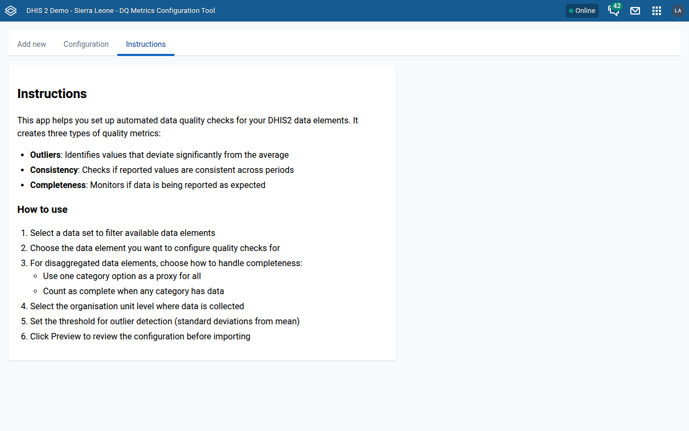

---

## Glossary

- **DataStore** — a per-namespace key/value store DHIS2 exposes at `/api/dataStore`. This app stores its configs in the `dqConfig` namespace under three keys (`outliers`, `consistency`, `completeness`), each holding a list of per-DE entries.
- **Predictor** — a DHIS2 object that runs a formula over historical data and writes the result to a designated data element. Outlier and consistency metrics rely on predictors.
- **Indicator** — a DHIS2 formula that combines numerator and denominator expressions into a calculated value. Used here to express percentages.
- **Category option combo (CoC)** — a specific combination of category options. Disaggregated data elements store a value per CoC; the "default" CoC represents the undisaggregated total.

---

## Known limitations

- Only monthly data sets are fully automated. Configuring against a non-monthly data set emits a warning; the generated expressions must be adjusted by hand.
- Only the outlier threshold can be edited in place; any other change requires remove + re-create.
- Cross-instance portability is not supported — the DataStore stores UIDs, which differ between instances. Exporting metadata and importing to another instance will orphan the references.
- `code` fields are not set on any generated metadata, so no `code` conflict check is performed during preview.

---

## Appendix — Testing notes

This manual (text and screenshots) was produced by walking through every flow against a live DHIS2 2.43 test instance (Sierra Leone demo database) with the app installed via `POST /api/apps`. Screenshots were captured at 1280×800.

For anyone reproducing or extending the tests:

1. A parameterized end-to-end suite covering the full lifecycle (initialise → configure → preview → import → verify → edit threshold → delete incl. metadata) lives at `tests/e2e/lifecycle.sh`. It is frame-aware: DHIS2 2.42+ serves installed apps inside a global-shell iframe, while 2.41 and earlier serve them at the top level.
2. For browser automation, authenticate with a Basic-auth `GET /api/me` to establish the session cookie — the React login form resists scripted form fills.
3. **Console noise in normal operation** (not app bugs): a `PWA features will not work` error on plain-HTTP instances (no secure context), a 404 for `/api/staticContent/logo_banner` when the instance has no custom logo, and two `StyleSheet: illegal rule` warnings from the `@dhis2/ui` CSS reset in Chromium.
